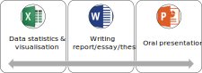
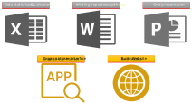

class: center, middle, inverse

```{r setup, echo=FALSE}
source("dep.R")

library(metathis)
library(xaringanExtra)

source("par.R")$value
source("hea.R")$value
```

---

# What is R

## for .red[nonprogrammer]: R is a .red[programming language]

## for .red[programmer]: R is just a .red[statistical software] (like SPSS, SAS)

## for someone like .red[me]: R can do .red[a lot of things]

???

nonprogrammer: https://en.wiktionary.org/wiki/nonprogrammer#English

programming language: https://en.wikipedia.org/wiki/Programming_language

---

class: center, middle

# A general research workflow

```{r, out.width = "80%", fig.align='center', fig.cap=''}

```

---

class: center, middle

# Other utilities

```{r, out.width = "80%", fig.align='center', fig.cap=''}

```

---

```{r embed-xaringan, echo=FALSE}
knitr::include_url('https://ps29.shinyapps.io/shinyg2/', height = "650px")
```

---

background-image: url(img/p1-5.svg)
background-size: contain

<br><br><br><br><br><br><br><br>

### .red[R for Data ]
### .red[Analysis]

---

background-image: url(img/p1-6.png)
background-size: contain

???

# errors usually exist in: 

---

class: inverse, center, middle

## [NEXT PART <br><br> Multi-Omics Data Analysis Workflow](r-for-multiomics-analysis.html)
