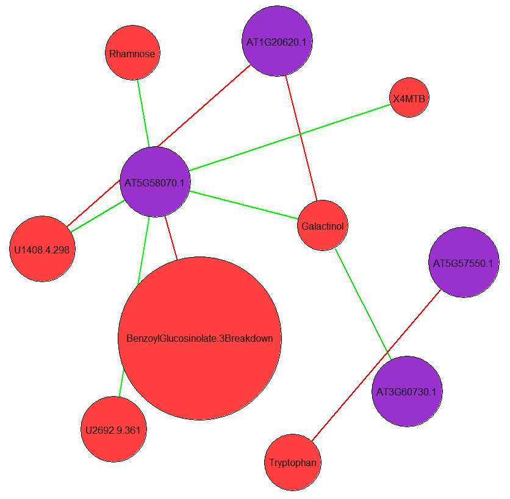

class: center, middle, inverse

```{r setup, echo=FALSE}
source("dep.R")

library(metathis)
library(xaringanExtra)

source("par.R")$value
source("hea.R")$value
```

---

# Multi-omics Data types

```{r, out.width = "100%", fig.align='center', fig.cap='multi-omic data table'}

```

---

class: center
background-image: url(img/p2-2.svg)
background-size: contain

# Analysis workflow

---

# Uni-variate analysis

.panelset[

.panel[
.panel-name[BoxPlot]
.pull-left-30[
```{r, out.width = "100%", fig.align='center', fig.cap='boxplot of asparate'}

```
]

.pull-right-70[
```{r, echo=T, eval=FALSE}
# remplissage des box selon modalités de temperature
ggplot(table2, aes(fill=temperature)) + 
  geom_boxplot(aes_string(x=temperature, y=table2[,i])) +
  
  # formatage 
  labs(
    title=varname, 
    x = "temperature conditions", 
    y = "metabolites abundance"
  ) + 
  theme(
    plot.title = element_text(colour="red", size=30,hjust=0.5), 
    axis.title.x = element_text(colour="black", size=15), 
    axis.title.y = element_text(colour="black", size=15), 
    axis.text.x = element_text(colour="black", size=15), 
    axis.text.y = element_text(colour="black", size=15)
  ) + 
  scale_fill_manual(
    breaks = c("Low","Medium","Elevated"), 
    values=c("lightblue", "green", "orange")) 
```
]
]

.panel[
.panel-name[One-Factor ANOVA]
.pull-left-60[
```{r, echo=T, eval=FALSE}
aov(table2[,i]~temperature, data=table2)

Call:
   aov(formula = table2[, 5] ~ temperature, data = table2)

Terms:
                temperature  Residuals
Sum of Squares   0.05236010 0.00346879
Deg. of Freedom           2          6

Residual standard error: 0.02404438
Estimated effects may be unbalanced

summary(aov(table2[,i]~temperature, data=table2))

            Df  Sum Sq  Mean Sq F value  Pr(>F)    
temperature  2 0.05236 0.026180   45.28 0.00024 ***
Residuals    6 0.00347 0.000578                    
---
Signif. codes:  0 ‘***’ 0.001 ‘**’ 0.01 ‘*’ 0.05 ‘.’ 0.1 ‘ ’ 1
```
]

.pull-right-40[
```{r, echo=T, eval=FALSE}
pvalue.anova.adj <- p.adjust(
  pvalue.anova,
  method="fdr"
)

table(pvalue.anova<0.05)
FALSE  TRUE
   65    70

table(pvalue.anova.adj<0.05)
FALSE  TRUE
   73    62
```
]
]

.panel[
.panel-name[Multi-Comparison]
.pull-left-30[
```{r, out.width = "100%", fig.align='center', fig.cap='boxplot of asparate with Tukey test'}

```
]

.pull-right-70[
```{r, echo=T, eval=FALSE}
TukeyHSD(aov(table2[,i]~temperature, data=table2))

  Tukey multiple comparisons of means
    95% family-wise confidence level

Fit: aov(formula = table2[, 5] ~ temperature, data = table2)

$temperature
                      diff         lwr       upr     p adj
Medium-Low      0.13091624  0.07067942 0.1911531 0.0013400
Elevated-Low    0.18089536  0.12065853 0.2411322 0.0002267
Elevated-Medium 0.04997911 -0.01025771 0.1102159 0.0962989
```
]

]

]

---

# Multi-variate analysis

.panelset[

.panel[
.panel-name[Principal Component Analysis (PCA)]

.pull-left-30[
```{r, out.width = "80%", fig.align='center', fig.cap='R in action (2nd edition). Kabacoff et al. 2015.'}

```
]

.pull-right-70[
```{r, out.width = "80%", fig.align='center', fig.cap='PCA projection by PC1 & PC2 (proteomic data)'}

```
]

]

.panel[
.panel-name[Hierarchial Clustering]
```{r, out.width = "100%", fig.align='center', fig.cap='Heatmap of 70 selected metabolites'}

```
]

]

---

# Multi-variate integration

.panelset[

.panel[
.panel-name[Integrated hierarchial clustering]
```{r, out.width = "100%", fig.align='center', fig.cap='Heatmap of selected metabolites & proteins'}

```
]

.panel[
.panel-name[co-expression analysis (mixOmics)]

.pull-left[
```{r, out.width = "80%", fig.align='center', fig.cap='network visualisation'}

```
]

.pull-right[
```{r, out.width = "77.5%", fig.align='center', fig.cap='circos visualisation'}

```
]

]

]
